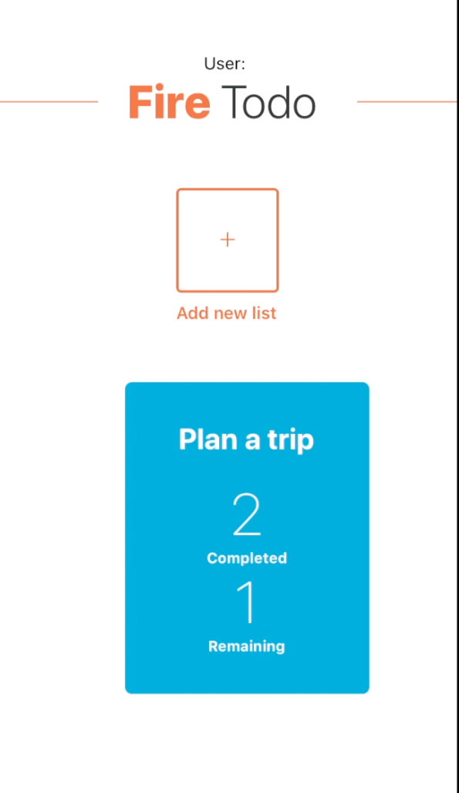
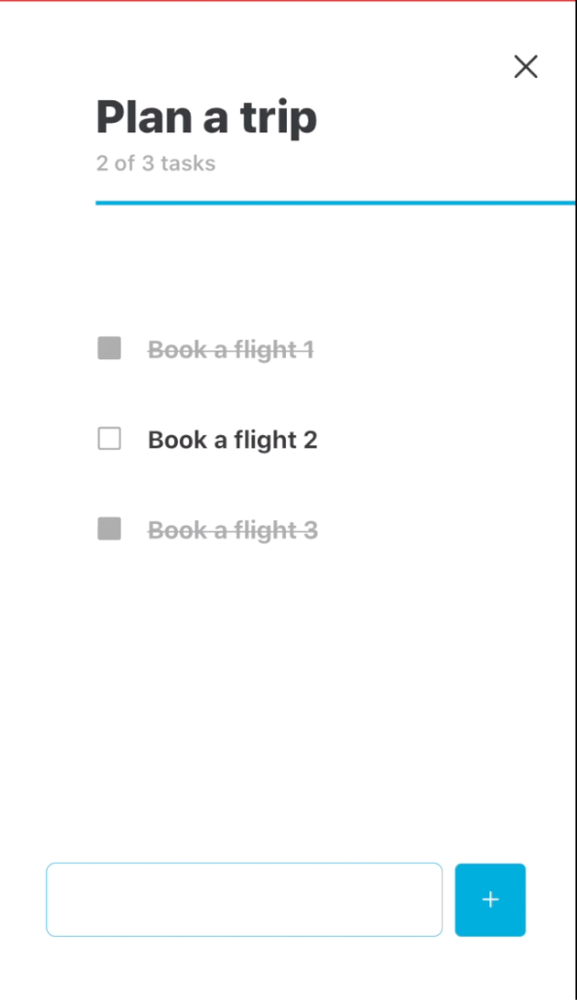
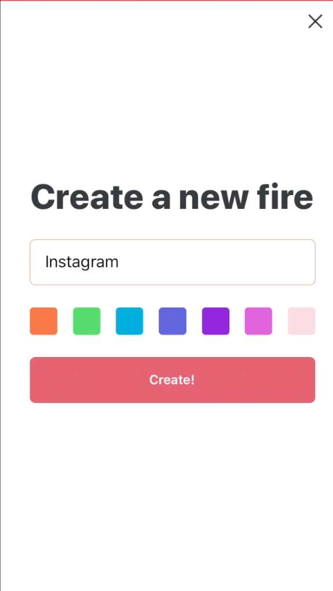
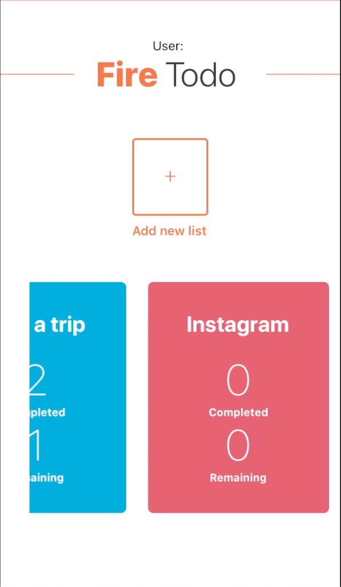
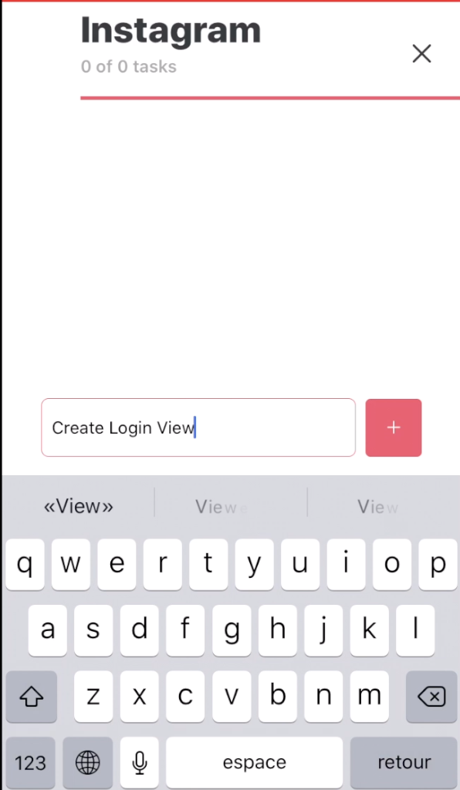

# :fire:Todo 
### A React Native App

An easy but yet alternate todo list based on fires(projects) integrated with Firebase

## Features

- Create Fires(Projects)
- Add todo item to Fires
- Set todo items as completed or pending
- Interactive view to see number of pending and completed tasks for each Fire
- Store data to Firebase (PENDING)

## How to use?

1. Download or clone this repo.
   ```js
   $ git clone https://github.com/rutaks/fire-todo.git
   $ cd fire-todo/
   ```

2. Install dependencies.

```js
$ expo install
```

3. Run project on iOS / Android.

```js
 expo start // expo start android || expo start ios
```

Project was created using [Expo](https://expo.io/). If you want standard native project please run following command:

```js
expo eject
```

## Previews
 
 
 
 
 

#### Made with :coffee: by [Rutaks](https://github.com/rutaks/)